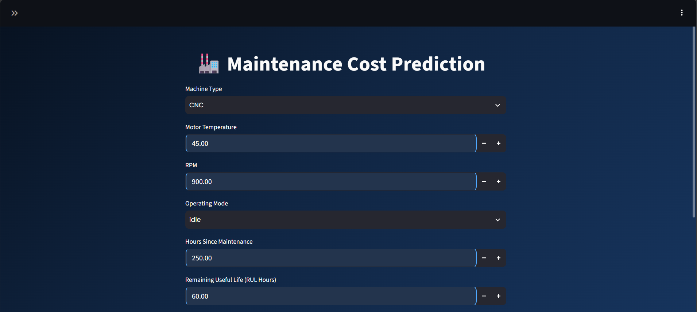
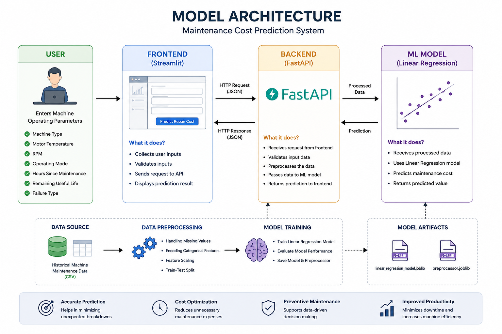
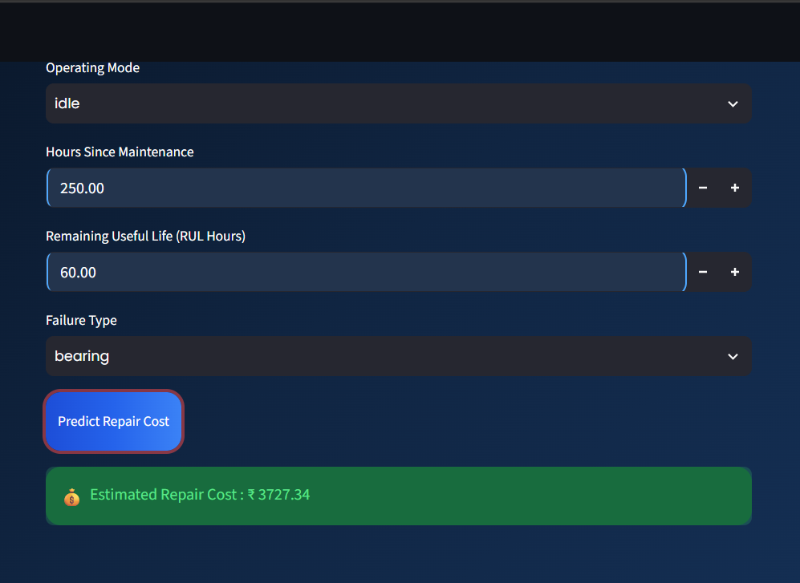

# 🏭 Maintenance Cost Prediction

A Machine Learning web application that predicts industrial machine maintenance costs using operational sensor data.


     


## 🎯 Project Goal

Unexpected machine failures can lead to production downtime and increased maintenance expenses.

The goal of this project is to build a Machine Learning application that estimates the expected maintenance cost of an industrial machine before maintenance is performed. This helps maintenance teams identify expensive failures early, plan preventive maintenance, and reduce operational costs.

The project is built with:

- Python
- Scikit-learn
- FastAPI
- Streamlit
- Docker
- Docker Compose

---

## 📖 Project Overview

This application predicts the maintenance cost of industrial equipment using operational machine data.

The application is designed for:

- Manufacturing Industries
- Production Plants
- Factory Maintenance Teams
- Predictive Maintenance Systems
- Industrial IoT Applications

Users can enter machine operating parameters through an interactive web interface and instantly receive the estimated maintenance cost predicted by the Machine Learning model.

# 🖥️ Tech Stack

| Technology | Purpose |
|------------|---------|
| Python | Programming Language |
| Pandas | Data Processing |
| Scikit-learn | Machine Learning |
| FastAPI | Backend API |
| Streamlit | Frontend UI |
| Docker | Containerization |
| Docker Compose | Multi-container Management |

---

# 📂 Project Structure

```text
Maintenance_Cost_Prediction/

│
├── backend/
│      app.py
│
├── frontend/
│      app.py
│      Dockerfile
│
├── data/
│      processed_data.csv
│      predictive_maintenance.csv
|  
├── model/
│      linear_regression_model.joblib
│      preprocessor.joblib
│
├── notebooks/
│
├── Dockerfile
├── docker-compose.yml
├── requirements.txt
├── .dockerignore
├── .gitignore
└── README.md
```
---

# ⚙️ Backend (FastAPI)

The backend is developed using FastAPI and serves as the core prediction engine of the application. It loads the trained Linear Regression model and the preprocessing pipeline (joblib files) during startup to avoid loading them for every request. The API accepts machine operational parameters in JSON format, converts them into a Pandas DataFrame, applies the same preprocessing steps used during model training, generates the maintenance cost prediction, and returns the estimated repair cost as a JSON response. The backend also performs request validation using Pydantic, ensuring that only valid input data is processed.

Backend Responsibilities
Loads the trained Machine Learning model and preprocessor.
Validates user input using Pydantic.
Applies the preprocessing pipeline.
Predicts maintenance cost using the Linear Regression model.
Returns prediction results through a REST API.

---

# 🎨 Frontend (Streamlit)

The frontend is built using Streamlit to provide an interactive and user-friendly interface for maintenance cost prediction. Users can manually enter machine details or use the built-in dataset sample generator available in the sidebar. After submitting the input, the frontend sends the data to the FastAPI backend and displays the predicted maintenance cost in real time.

Frontend Features
Interactive and responsive user interface.
Machine parameter input using dropdowns and numeric fields.
Real-time prediction using the FastAPI backend.
Modern dashboard with a professional UI.
Displays the predicted maintenance cost instantly.

---

# 📊 Sidebar Features

The sidebar is designed to simplify model testing by automatically loading random records from the original dataset.

Available Options:

🔴 High Repair Cost

Randomly selects a machine record from the top repair-cost samples in the dataset.
Automatically fills all input fields with the selected record.

🟢 Low Repair Cost

Randomly selects a machine record from the lowest repair-cost samples.
Automatically populates all input fields.

🎲 Random Sample

Loads a completely random machine record from the dataset.
Useful for testing different prediction scenarios.

The sidebar also displays the actual repair cost of the selected dataset record, allowing users to compare it with the model's predicted value.

---

# Overall Application Workflow

The application follows a simple end-to-end workflow to predict the maintenance cost of an industrial machine.

1. User Input

The user enters machine details through the Streamlit interface or automatically fills the input fields using the High Repair Cost, Low Repair Cost, or Random Sample options available in the sidebar.

2. Request Creation

After clicking the Predict Repair Cost button, Streamlit collects all input values and converts them into a JSON request.

3. API Communication

The JSON request is sent to the FastAPI backend through an HTTP POST request. The Uvicorn server receives the request and forwards it to the prediction API.

4. Input Validation

FastAPI uses Pydantic to validate the incoming data. It checks whether all required fields are present and whether each value has the correct data type before processing the request.

5. Data Preprocessing

The validated input is converted into a Pandas DataFrame and passed through the saved preprocessing pipeline (preprocessor.joblib). The same transformations used during model training, such as categorical encoding and feature preprocessing, are applied to ensure consistency.

6. Model Prediction

The processed data is provided to the trained Linear Regression model (linear_regression_model.joblib), which estimates the maintenance cost based on the learned relationships between the input features and the target variable.

7. Response Generation

The predicted maintenance cost is converted into a JSON response and returned by FastAPI through the Uvicorn server.

8. Result Display

The Streamlit frontend receives the response, extracts the predicted value, and displays the estimated maintenance cost to the user. If the input was loaded from the sidebar dataset, users can also compare the actual repair cost with the predicted repair cost.

---

## ✨ Features of Application

- Maintenance Cost Prediction

- FastAPI REST API

- Interactive Streamlit Dashboard

- Real Dataset Testing

- High Cost Sample Generator

- Low Cost Sample Generator

- Random Sample Generator

- Docker Support

- Docker Compose Support

- Responsive UI

---

# 🚀 Installation

Clone the repository

```bash
git clone <repository-url>
```

Go to project folder

```bash
cd Maintenance_Cost_Prediction
```

Create virtual environment

```bash
python -m venv venv
```

Activate environment

Windows

```bash
venv\Scripts\activate
```

Install dependencies

```bash
pip install -r requirements.txt
```

---

# ▶️ Run Backend

```bash
uvicorn backend.app:app --reload
```

Backend URL

```
http://localhost:8000
```

---

# ▶️ Run Frontend

```bash
streamlit run frontend/app.py
```

Frontend URL

```
http://localhost:8501
```

---

# 🐳 Run Using Docker Compose

Build and start containers

```bash
docker compose up --build
```

Stop containers

```bash
docker compose down
```

---

# 📊 Machine Learning Model

Algorithm

- Linear Regression

Model Serialization

- Joblib

---

# 📌 Input Features

- Machine Type
- Motor Temperature
- RPM
- Operating Mode
- Hours Since Maintenance
- Remaining Useful Life
- Failure Type

---

# 📈 Output

Estimated Maintenance Cost

---

## 🏗️ Project Architecture

```text
          User
            │
            ▼
  Streamlit Frontend
            │
            ▼
     FastAPI Backend
            │
            ▼
 Machine Learning Model
            │
            ▼
 Estimated Repair Cost
```
---

## 📷 Screenshots

### Home Page



---

### Architechture



### Prediction Result




---

## 🌐 Live Demo

Render Deployment

(https://maintenance-pro-frontend.onrender.com)

Backend API

(https://maintenance-backend-pwvd.onrender.com)

---

## ☁️ Deployment

This application is containerized using Docker and deployed on Google Cloud Run.

# Deployment Platform

- Render Platform

# Backend Deployment:

Created a separate Render Web Service for the FastAPI backend.

Selected Docker as the deployment environment.

Used the root Dockerfile to build the backend image.

Exposed the application on the Render-assigned PORT.

The trained Linear Regression model and preprocessing pipeline are loaded during application startup.

The /predict endpoint receives JSON data and returns predictions in JSON format.

# Frontend Deployment:

Created another Render Web Service for the Streamlit frontend.

Used the frontend/ directory as the service root.

Built the frontend using the Dockerfile inside the frontend folder.

Streamlit is exposed on port 8501.

The frontend sends prediction requests to the deployed backend using its public API URL.

# Docker Configuration

Two independent Docker images are used.

Backend Container:

Python 3.12 Slim
FastAPI
Uvicorn
Scikit-learn
Loads trained model
Serves prediction API

Frontend Container:

Python 3.12 Slim
Streamlit
Pandas
Requests
Displays prediction interface
Communicates with FastAPI backend

Configuration Changes for Deployment

The following changes were made before deployment:

Updated the frontend API URL from localhost to the deployed backend URL.
Added the required project files inside the frontend directory.
Included the processed dataset required by the Streamlit application.
Configured Dockerfiles separately for backend and frontend.
Configured Render to build each service from the correct Dockerfile.
Used separate Web Services for frontend and backend deployment.

# Issues Solved During Deployment

Several deployment issues were identified and resolved:

Issue	Solution
Localhost API URL	Replaced with Render backend URL
Missing dataset in frontend container	Added processed_data.csv to the frontend directory
Incorrect Docker build context	Configured the correct Root Directory and Dockerfile Path
Missing requirements.txt during build	Updated Docker build paths
Streamlit file watcher warnings	Disabled file watcher for production
Backend communication issues	Updated API endpoint configuration

---

## 🚀 Future Improvements

- XGBoost Model

- Random Forest

- Model Monitoring

- Authentication

- Database Integration

- CI/CD Pipeline

- Kubernetes Deployment

---
# 👨‍💻 Author

**Yaswanth Pusuluri**

Machine Learning | Data Science | Python Developer

Python | FastAPI | Docker | Scikit-learn

GitHub:
https://github.com/yaswanthpusuluri

LinkedIn:
https://linkedin.com/in/yaswanth-pusuluri
